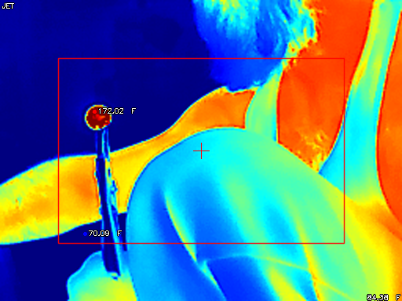

# GoThermalCamera

recreating the functionality of -> https://github.com/leswright1977/PyThermalCamera in go

## Functionality

* displays the image with colormaps
* take images
* take videos
* center pixel temp
* high low temp points



## keymap
```shell
keymap:
        z x | scale image - + 
        b n | thermal area - +
         l  | toggle temp conversion
         c  | toggle crosshair
         h  | toggle high low Points
         m  | cycle through colormaps
         p  | save frame to PNG file
        r t | record / stop
         q  | quit

```

## Args
```shell
    -d   device int
```

## bugs

* The inital windows does not want to resize down only up, closing the window fixes it, allowing for normal resizing 
* random seg faults on startup, lol
