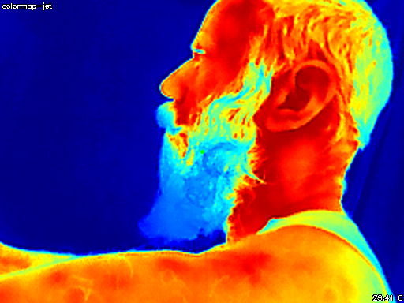

# GoThermalCamera

recreating the functionality of -> https://github.com/leswright1977/PyThermalCamera in go

## Functionality

* displays the image with colormaps
* take images
* take videos
* center pixel temp



## keymap
```shell
keymap:
        + - | scale image
         c  | toggle temp conversion
         h  | toggle hud
         m  | cycle through colormaps
         p  | save frame to file
        r t | record / stop
         q  | quit
```

## Args
```shell
    -d   device int
```
